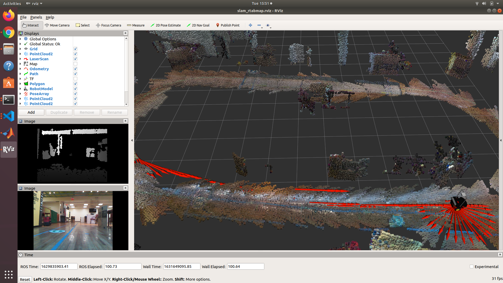

# `sunny_mapping`
This repository demostrates the use of [`rtabmap_ros`](http://wiki.ros.org/rtabmap_ros) with the data from the wheel odometry of P3-DX robot and the RGBD images from a Kinect XBox 360 mounted on the robot. The data was collected at Sunnyside Community Services, Sunnyside, NY.

## Prerequisites
* Ubuntu 18.04
* ROS Melodic
* [catkin workspace](http://wiki.ros.org/catkin/Tutorials/create_a_workspace)
* Install [`rtabmap_ros`](http://wiki.ros.org/rtabmap_ros)
```bash
sudo apt install ros-melodic-rtabmap-ros
```

## Usage
* Clone the repo into the `src` folder of your catkin workspace
* Navigate into this repo `sunny_mapping`
* Download the bag files from [here](https://stevens0-my.sharepoint.com/:f:/g/personal/zchen39_stevens_edu/Eo5xFJbi8x1EmlTc90JqyRkBtkFwsa9X4WIu08ymogQDfQ?e=q95nlp) into `bags` folder so the tree looks like
```
.
├── bags
│   ├── data1.bag
│   └── data2.bag
├── CMakeLists.txt
├── launch
│   └── play.launch
├── package.xml
├── readme.md
└── urdf
    └── gtr2.urdf
```
* `catkin_make` in your catkin workspace directory
* Source `devel/setup.bash`
```bash
source devel/setup.bash
```
* Run the demo and the rviz should pop up as follows
```bash
roslaunch sunny_mapping play.launch
```
